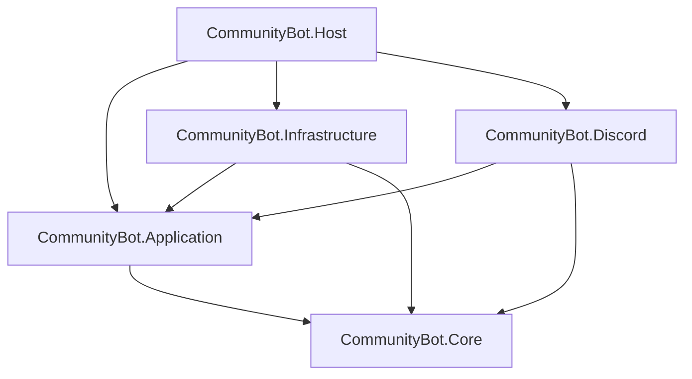

# CommunityBot

[](https://github.com/Lucas-Courbet/CommunityBot/actions/workflows/ci.yml)

CommunityBot is a **.NET 10 / PostgreSQL Discord application** built as a public engineering showcase.

It is a deliberately reduced and domain-neutral adaptation of a larger private application that I build and maintain. The public repository keeps representative production patterns while removing private business concepts, configuration and data.

## Scope

CommunityBot is a deliberately reduced and domain-neutral public adaptation of a larger private application that I build and maintain.

The repository preserves representative architectural and implementation patterns from the real project while removing private business concepts, production configuration and data.

It is intentionally not a feature-complete clone. Features are included only when they help demonstrate a distinct engineering concern or complete a public end-to-end workflow.

## What this repository demonstrates

- Layered architecture with explicit project boundaries
- PostgreSQL transactions and pessimistic row locking
- Atomic balance, inventory and financial-ledger updates
- Durable asynchronous processing with background workers
- Savepoints, degraded capture, retry and reconciliation
- External Discord side effects without holding database transactions open
- Integration tests against real PostgreSQL through Testcontainers
- Dockerized runtime and GitHub Actions CI

## 5-minute code tour

Short on time? These are the best places to start.

| Area | Start here | What to look for |
| --- | --- | --- |
| Transactional workflow | [`ShopPurchaseService`](src/CommunityBot.Application/Shop/ShopPurchaseService.cs) | Explicit transaction ownership, row locking, inventory mutation, financial transaction and durable activity capture |
| External side effect | [`RoleRewardDeliveryHandler`](src/CommunityBot.Application/Rewards/RoleRewardDeliveryHandler.cs) | Discord call outside the DB transaction, then short locked finalization |
| Durable processing | [`ActivityCaptureService`](src/CommunityBot.Infrastructure/Activities/ActivityCaptureService.cs) | Savepoints, conservative capture, incidents and recovery boundaries |
| Concurrent worker claim | [`ActivityConsumptionRepository`](src/CommunityBot.Infrastructure/Persistence/Activities/ActivityConsumptionRepository.cs) | PostgreSQL `FOR UPDATE SKIP LOCKED` |
| End-to-end example | [`CommunityGoalActivityIntegrationTests`](tests/CommunityBot.Tests/Integration/Goals/CommunityGoalActivityIntegrationTests.cs) | Shop purchase → durable activity → worker consumption → persisted projection |

## Architecture



| Project | Responsibility |
| --- | --- |
| `CommunityBot.Core` | Domain entities, state and business rules |
| `CommunityBot.Application` | Use cases, orchestration, application contracts and persistence ports |
| `CommunityBot.Infrastructure` | EF Core, PostgreSQL repositories, workers, migrations and seeders |
| `CommunityBot.Discord` | NetCord interactions, rendering, pagination and Discord adapters |
| `CommunityBot.Host` | Composition root, configuration, startup and hosting |
| `CommunityBot.Tests` | Unit tests and PostgreSQL integration tests |

`Core` has no project dependency. `Application` depends only on `Core`. Infrastructure and Discord provide adapters around the application layer, while the Host composes the application.

## Key workflows

### 1. Atomic shop purchase

A purchase coordinates several state changes inside one caller-owned transaction:

```text
Purchase request
      |
      v
Lock member row (FOR UPDATE)
      |
      v
Validate item and balance
      |
      v
Acquire inventory item
      |
      v
Debit Currency
      |
      v
Persist financial transaction
      |
      v
Flush source changes
      |
      v
Capture durable activity
      |
      v
Commit
```

This keeps balance, inventory and transaction history consistent under concurrency.

Related code:

- [`ShopPurchaseService`](src/CommunityBot.Application/Shop/ShopPurchaseService.cs)
- [`ShopPurchaseStore`](src/CommunityBot.Application/Shop/ShopPurchaseStore.cs)
- [`ItemAcquisitionService`](src/CommunityBot.Application/Items/ItemAcquisitionService.cs)
- [`TransactionService`](src/CommunityBot.Application/Economy/TransactionService.cs)
- [`ShopPurchaseServiceIntegrationTests`](tests/CommunityBot.Tests/Integration/Shop/ShopPurchaseServiceIntegrationTests.cs)

### 2. External Discord effect with safe DB finalization

Role delivery deliberately avoids keeping a database transaction open during a network call:

```text
Read delivery snapshot
      |
      v
Call Discord
(outside DB transaction)
      |
      v
Begin short transaction
      |
      v
Reload entitlement FOR UPDATE
      |
      v
Verify snapshot still matches
      |
      v
Persist outcome and commit
```

Related code:

- [`RewardDeliveryService`](src/CommunityBot.Application/Rewards/RewardDeliveryService.cs)
- [`RoleRewardDeliveryHandler`](src/CommunityBot.Application/Rewards/RoleRewardDeliveryHandler.cs)
- [`CurrencyRewardDeliveryHandler`](src/CommunityBot.Application/Rewards/CurrencyRewardDeliveryHandler.cs)
- [`ItemRewardDeliveryHandler`](src/CommunityBot.Application/Rewards/ItemRewardDeliveryHandler.cs)

### 3. Durable activity processing

The activity subsystem captures immutable application facts for asynchronous consumers while preserving ownership of the source transaction.

Nominal path:

```text
Source transaction
      |
      v
Flush source mutations
      |
      v
Capture savepoint
      |
      v
Lock event-type gate
      |
      v
Resolve subscriptions
      |
      v
Persist ActivityEvent + consumptions
      |
      v
Release savepoint
      |
      v
Source transaction commits
```

If nominal capture fails with a recoverable persistence error, the subsystem can persist the fact conservatively together with a reconciliation marker. A background worker later rebuilds the missing consumptions.

Pending work is claimed with:

```sql
FOR UPDATE SKIP LOCKED
```

Transient failures use a durable retry schedule; exhausted or permanent failures end in an error state.

Related code:

- [`ActivityCaptureService`](src/CommunityBot.Infrastructure/Activities/ActivityCaptureService.cs)
- [`ActivityCaptureTransactionCoordinator`](src/CommunityBot.Infrastructure/Activities/ActivityCaptureTransactionCoordinator.cs)
- [`ActivityConsumptionService`](src/CommunityBot.Infrastructure/Activities/Consumption/ActivityConsumptionService.cs)
- [`ActivityConsumptionFailureService`](src/CommunityBot.Infrastructure/Activities/Consumption/ActivityConsumptionFailureService.cs)
- [`ActivityReconciliationService`](src/CommunityBot.Infrastructure/Activities/ActivityReconciliationService.cs)

> `CommunityGoal` is a small synthetic showcase feature created only to make the public durable-processing pipeline observable end to end. It is not a reconstruction of a private business feature.

## Discord presentation

The public Discord vertical demonstrates how interaction code stays separate from application and persistence concerns.

```text
/shop
  |
  v
ShopModule
  |
  v
ShopInteractionModule
  |
  +--> rendering
  +--> pagination
  +--> purchase interaction service
  |
  v
Application ShopPurchaseService
```

Useful entry points:

- [`ShopModule`](src/CommunityBot.Discord/Shop/ShopModule.cs)
- [`ShopInteractionModule`](src/CommunityBot.Discord/Shop/ShopInteractionModule.cs)
- [`ShopPaginationStrategy`](src/CommunityBot.Discord/Shop/ShopPaginationStrategy.cs)
- [`PaginationDispatcher`](src/CommunityBot.Discord/Pagination/PaginationDispatcher.cs)
- [`ResponseService`](src/CommunityBot.Discord/Interactions/ResponseService.cs)

## Persistence and concurrency

The repository uses Entity Framework Core with PostgreSQL-specific primitives where stronger guarantees are needed.

Examples include:

- explicit database transactions
- `FOR UPDATE`
- `FOR UPDATE SKIP LOCKED`
- transaction savepoints
- unique and check constraints
- EF Core audit interception
- schema evolution through migrations
- idempotent startup seeding

The public catalog is synchronized by [`ShopCatalogSeeder`](src/CommunityBot.Infrastructure/Persistence/Seeders/ShopCatalogSeeder.cs) using synthetic data only.

## Testing

The test suite contains both unit tests and integration tests.

Integration tests run against **real PostgreSQL 17** through Testcontainers rather than EF Core's in-memory provider. This allows the suite to exercise actual PostgreSQL behavior, including row locking, concurrent transactions and `SKIP LOCKED`.

Representative coverage includes:

- concurrent unique-item purchases
- balance and transaction atomicity
- reward delivery concurrency
- activity retry scheduling
- reconciliation
- migrations and audit persistence
- complete Shop → Activity → Community Goal processing

Run the suite with:

```bash
dotnet test -c Release
```

Docker must be available for the PostgreSQL integration tests.

## Running locally

### Docker Compose

Copy the sample environment file:

```bash
cp .env.example .env
```

Then start the stack:

```bash
docker compose up --build
```

Startup performs:

```text
PostgreSQL
   |
   v
EF Core migrations
   |
   v
Synthetic catalog synchronization
   |
   v
Background workers
   |
   v
Discord gateway (only when enabled)
```

Discord is disabled by default, so no Discord token is required to build, test or start the application.

### Direct .NET execution

With PostgreSQL available using the connection string from `appsettings.json`:

```bash
dotnet run --project src/CommunityBot.Host
```

## Continuous integration

GitHub Actions runs on pushes and pull requests targeting `main`.

The workflow performs:

```text
Restore
  |
Build (Release)
  |
Run unit + PostgreSQL integration tests
  |
Build Docker image
```

See [`.github/workflows/ci.yml`](.github/workflows/ci.yml).